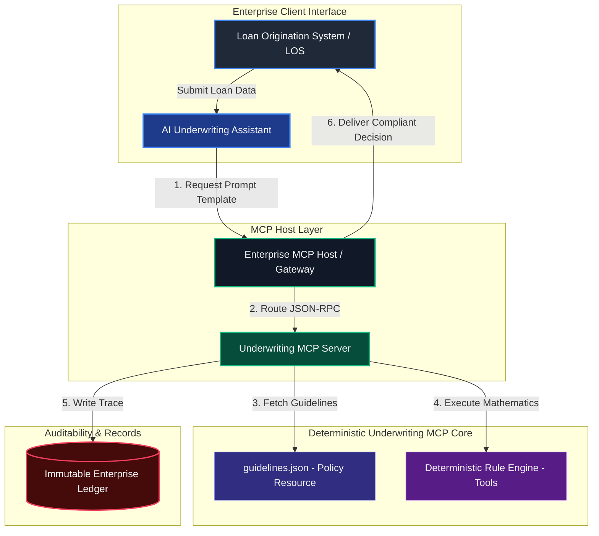

# Enterprise AI Underwriting Model Context Protocol (MCP) Server
### Decoupling Probabilistic Reasoning from Deterministic Compliance for Autonomous Agentic Workflows

---

## 1. Executive Summary & The AI Underwriting Paradox

Deploying autonomous Large Language Model (LLM) agents within highly regulated financial environments (e.g., mortgage lending) presents a fundamental architectural paradox:

1.  **Reasoning vs. Accuracy**: LLMs excel at probabilistic reasoning—such as analyzing unstructured documents, extracting entities, and understanding user intents. However, they are mathematically unreliable. They cannot guarantee the zero-fault arithmetic and rigid logic gate execution required for credit decisions.
2.  **Context Window Bloat**: Injecting hundreds of pages of unstructured underwriting guidelines directly into the LLM context window causes cognitive fatigue, retrieval degradation (needle-in-a-haystack issues), and high token overhead.
3.  **The Explainability Gap**: Regulatory frameworks, such as the Consumer Financial Protection Bureau (CFPB) under the **Equal Credit Opportunity Act (ECOA / Regulation B)**, mandate that credit decisions be deterministic and transparent. Probabilistic "black-box" decisions cannot deliver reproducible audit logs, creating compliance vulnerabilities.

```
                    ┌───────────────────────────────────────────────┐
                    │     Probabilistic Reasoning (LLM Client)      │
                    │   - Extracts financial variables from files   │
                    │   - Reasons on intents and reviews exceptions │
                    └───────────────────────┬───────────────────────┘
                                            │
                                            │ (Model Context Protocol)
                                            ▼
                    ┌───────────────────────────────────────────────┐
                    │    Deterministic Compliance (MCP Server)      │
                    │   - Exposes structured Contextual Resources   │
                    │   - Executes sandboxed mathematical Tools     │
                    │   - Feeds dynamic User Context via Prompts    │
                    └───────────────────────────────────────────────┘
```

This repository implements the **Model Context Protocol (MCP)** standard. By acting as the secure, standardized bridge between generative AI models and localized computational business logic, this server decouples **reasoning** from **calculation**. The LLM operates as the cognitive coordinator, while this MCP server executes deterministic, mathematically validated credit rules and returns version-pinned, auditable decisions.

---

## 2. Technical System Architecture

### 2.1 The Client-Host-Server Topology
This server conforms to the core Model Context Protocol specification, running as a secure, sandboxed process communicating over standard input/output (`stdio`) using structured **JSON-RPC 2.0** payloads.



### 2.2 The AI Agentic Cognitive Underwriting Loop
When an AI agent evaluates a borrower's creditworthiness, it operates in a structured five-stage cognitive loop powered by our MCP server:

```
  ┌────────────────────────────────────────────────────────┐
  │ 1. INITIALIZE: Agent retrieves System Prompts           │
  └──────────────────────────┬─────────────────────────────┘
                             ▼
  ┌────────────────────────────────────────────────────────┐
  │ 2. INGEST: Agent reads borrower payload data           │
  └──────────────────────────┬─────────────────────────────┘
                             ▼
  ┌────────────────────────────────────────────────────────┐
  │ 3. CONTEXT EXTENSION: Agent reads Guideline Resources  │
  └──────────────────────────┬─────────────────────────────┘
                             ▼
  ┌────────────────────────────────────────────────────────┐
  │ 4. DETERMINISTIC RUN: Agent executes compliance Tools  │
  └──────────────────────────┬─────────────────────────────┘
                             ▼
  ┌────────────────────────────────────────────────────────┐
  │ 5. SYNTHESIS: Agent generates audit-friendly summary   │
  └────────────────────────────────────────────────────────┘
```

1.  **Initialize**: The agent fetches the `guided_underwriting_review` prompt template from the MCP server, establishing its system directives, operational boundaries, and cognitive workflow.
2.  **Ingest**: The agent parses the borrower's raw documents, extracting variables such as monthly income, recurring debts, and credit scores.
3.  **Context Extension**: The agent queries the `guidelines://corporate/credit-policy` resource to dynamically read the core conforming limits and reserve guidelines into its context window without risking hallucination.
4.  **Deterministic Action**: The agent calls `evaluate_loan_compliance` tool. The MCP server executes compiled Python mathematics to check the exact credit thresholds, outputting a structured decision trace.
5.  **Synthesis**: The agent merges the tool results, policies, and calculation audit tokens to write a transparent, compliant underwriting summary.

---

## 3. Data Governance & Regulatory Compliance Framework

### 3.1 Model Risk Management (SR 11-7 Compliance)
Consistent with Federal Reserve Supervised Regulation **SR 11-7 (Guidance on Model Risk Management)**, this server strictly prevents LLM reasoning components from performing credit-policy arithmetic or direct database lookups. Ratios and approval statuses are evaluated inside a secure Python sandbox, guaranteeing **zero arithmetic drift** and **100% mathematical reproducibility**.

### 3.2 Fair Lending & ECOA (Regulation B) Explainability
Under the Equal Credit Opportunity Act, any credit denial or modification requires a **Statement of Adverse Action** detailing the principal reasons for the decision. 
- Every calculation executed by this MCP server returns a structured `rejection_reasons` or `warnings` array.
- Decisions reference exact credit guidelines sections (e.g., `FNMA Section B3-6-02`).
- The server appends a regulatory disclosure statement to every automated response, ensuring compliance guardrails:

> "This automated loan evaluation has been conducted in accordance with credit scoring guidelines and deterministic algorithms. Decisions conform strictly to the Equal Credit Opportunity Act (ECOA) (15 U.S.C. § 1691 et seq.) and Fair Lending guidelines. Hallucinations are mathematically mitigated."

### 3.3 Cryptographic Policy Pinned Auditing
The guidelines database (`guidelines.json`) features a unique `policy_reference_hash`. When an evaluation is executed, this hash and a unique transaction UUID are locked into the returned `decision_audit_trail`. This guarantees that if a federal regulator audits a loan file years later, the bank can definitively prove the exact version of the underwriting rules active at the millisecond the evaluation was executed.

---

## 4. Protocol Specification: Prompts, Resources, and Tools

This server implements all three main primitives of the Model Context Protocol specification: **Prompts**, **Resources**, and **Tools**.

### 4.1 Exposed Prompts (Contextual Configuration)
Prompts are pre-configured templates that structure the AI agent's system directives and guide its cognitive loop.

#### `guided_underwriting_review`
Instructs the agent how to run a Fair Lending compliant credit policy check on a specific applicant.

*   **Arguments**:
    *   `borrower_name` (string, required): The name of the qualifying borrower.

**JSON-RPC Request Format:**
```json
{
  "jsonrpc": "2.0",
  "id": 9,
  "method": "prompts/get",
  "params": {
    "name": "guided_underwriting_review",
    "arguments": {
      "borrower_name": "Jane Doe"
    }
  }
}
```

**JSON-RPC Response Content:**
```json
{
  "jsonrpc": "2.0",
  "id": 9,
  "result": {
    "description": "Guided compliance underwriting review prompt",
    "messages": [
      {
        "role": "user",
        "content": {
          "type": "text",
          "text": "You are an elite automated underwriting assistant. You are conducting a compliance credit policy review for borrower 'Jane Doe'.\n\nINSTRUCTIONS:\n1. Gather the borrower's financial details (income, debts, loan amount, property value, credit score).\n2. Execute the 'evaluate_loan_compliance' tool to compute absolute ratios and verify rules.\n3. Retrieve the full policy database using the resource URI 'guidelines://corporate/credit-policy' to compare findings and check reserve months requirements based on credit scores.\n4. Synthesize a professional, Fair Lending compliant summary. Ensure you quote the 'decision_audit_token' and policy reference hashes returned by the tool."
        }
      }
    ]
  }
}
```

---

### 4.2 Exposed Resources (Dynamic Context Binding)
Resources represent structured, read-only datasets exposed to the AI model to prevent factual hallucination.

*   **URI**: `guidelines://corporate/credit-policy`
    *   **Description**: Exposes the complete active database containing all conforming credit score thresholds, conforming limits, and FHA debt-to-income limitations.
    *   **MIME-Type**: `application/json`

---

### 4.3 Exposed Tools (Action Execution Pipelines)
Tools are active computational pipelines exposed to the AI agent to delegate math calculations and logical validations.

#### `calculate_dti`
Calculates Front-End (Housing) DTI and Back-End (Total) DTI ratios.
*   **Input Schema**:
    *   `monthly_income` (number, required)
    *   `monthly_debts` (number, required)
    *   `proposed_housing_payment` (number, required)

#### `calculate_ltv_cltv`
Calculates Loan-To-Value (LTV) and Combined Loan-To-Value (CLTV) ratios.
*   **Input Schema**:
    *   `loan_amount` (number, required)
    *   `property_value` (number, required)
    *   `heloc_balance` (number, optional, default: 0)

#### `evaluate_loan_compliance`
Runs a full automated automated underwriting system (AUS) check against credit policy guidelines.
*   **Input Schema**:
    *   `program` (string, required): "conventional" or "fha"
    *   `loan_amount` (number, required)
    *   `property_value` (number, required)
    *   `monthly_income` (number, required)
    *   `monthly_debts` (number, required)
    *   `proposed_housing_payment` (number, required)
    *   `credit_score` (integer, required)
    *   `has_compensating_factors` (boolean, optional, default: false)

**Example Tool Response (evaluate_loan_compliance):**
```json
{
  "compliance_status": "APPROVED",
  "underwriting_summary": "Automatic Underwriting System (AUS) evaluation returns ACCEPT/PASS. The credit file satisfies standard Fannie Mae / FHA credit policies.",
  "ratios": {
    "ltv_percent": 77.78,
    "cltv_percent": 77.78,
    "front_dti_percent": 18.33,
    "back_dti_percent": 25.0
  },
  "rules_evaluated": [
    {
      "rule_name": "Conforming Loan Limit Validation",
      "status": "PASS",
      "observed": "$350,000.00",
      "limit": "<=$766,550.00",
      "policy_reference": "Guidelines Conforming Limits Table"
    },
    {
      "rule_name": "Minimum Bureau Credit Score Check",
      "status": "PASS",
      "observed": 760,
      "required": ">=620",
      "policy_reference": "Fannie Mae Conforming Guidelines - Credit Policy Standards"
    }
  ],
  "warnings": [],
  "rejection_reasons": [],
  "decision_audit_trail": {
    "uuid": "34d7ab12-3c0f-4264-a07e-394cf33b6060",
    "timestamp": "2026-05-21T04:27:16.894019+00:00",
    "policy_version": "2026.1.2",
    "policy_hash": "a9f82d1c68e3b3b448a5c104278efc225e01b34e5671d0e561a0b3f8bc911ea4",
    "audit_token": "DEC-TXN-1AC98B7BDC76EAD6"
  }
}
```

---

## 5. Deployment Playbook & Enterprise Integration

To deploy this MCP server inside a secure Azure enterprise environment utilizing **Azure Container Registry (ACR)** and **Azure App Service (Web App for Containers)**, follow this cloud operations playbook:

### 5.1 Containerization (Dockerfile)
This secure, slim-line Dockerfile runs our underwriting compliance engine as a non-privileged system user within a read-only filesystem environment:

```dockerfile
FROM python:3.11-slim-bookworm

# Establish security boundaries - Run as non-privileged system user
RUN groupadd -g 10001 underwriting && \
    useradd -u 10001 -g underwriting -s /bin/bash -m underwriting

WORKDIR /app

COPY --chown=underwriting:underwriting guidelines.json underwriting_mcp_server.py /app/

USER underwriting

EXPOSE 8080

ENTRYPOINT ["python", "/app/underwriting_mcp_server.py"]
```

### 5.2 Azure Cloud Deployment Playbook

#### Step 1: Provision the Azure Container Registry (ACR)
Provision a private container registry to host and scan the enterprise underwriting compliance images:

```bash
# Create the resource group
az group create --name rg-underwriting-prod --location eastus

# Create the Azure Container Registry (Premium SKU enables automated vulnerability scanning)
az acr create \
  --resource-group rg-underwriting-prod \
  --name acrunderwritingprod \
  --sku Premium
```

#### Step 2: Securely Build & Push Image to ACR
Leverage ACR Tasks to securely compile and build the container image in the cloud:

```bash
# Authenticate against your corporate registry
az acr login --name acrunderwritingprod

# Build and push the image directly to ACR with strict semver tag
az acr build \
  --registry acrunderwritingprod \
  --image underwriting-mcp-server:1.0.0 .
```

#### Step 3: Provision & Configure Azure App Service
Deploy the container onto a dedicated Linux App Service Plan. (For production MCP over HTTP, the server runs in Server-Sent Events (SSE) mode behind an HTTP/HTTPS endpoint):

```bash
# Create a Linux-based App Service Plan
az appservice plan create \
  --name plan-underwriting-mcp \
  --resource-group rg-underwriting-prod \
  --is-linux \
  --sku B1

# Deploy the Web App using the built ACR image
az webapp create \
  --resource-group rg-underwriting-prod \
  --plan plan-underwriting-mcp \
  --name app-underwriting-mcp \
  --role acrunderwritingprod.azurecr.io/underwriting-mcp-server:1.0.0

# Assign a System-Assigned Managed Identity for secure ACR access
az webapp identity assign \
  --resource-group rg-underwriting-prod \
  --name app-underwriting-mcp \
  --query principalId \
  --output tsv
```

#### Step 4: Configure App Settings & Network Routing
Expose the server port and enable environment configurations to facilitate uninterrupted stdio/SSE streaming:

```bash
# Define custom startup environment configurations
az webapp config appsettings set \
  --resource-group rg-underwriting-prod \
  --name app-underwriting-mcp \
  --settings \
    WEBSITES_PORT=8080 \
    PYTHONUNBUFFERED=1 \
    CREDIT_POLICY_ENVIRONMENT=PROD
```

### 5.3 Logging & Observability (OpenTelemetry)
All system logs are emitted in JSON format via `sys.stderr` to avoid corrupting `sys.stdout` JSON-RPC streams. These logs conform to the standard structured schema and are automatically scraped by logging agents (FluentBit, Splunk, Datadog) for real-time monitoring and security alerting.

---

## 6. Local Installation & Verification Guide

### 6.1 Prerequisites
- Python 3.8 or higher.
- No third-party pip libraries required.

### 6.2 Setup and Running
1. Clone this repository to your local directory.
2. Verify the server manually by executing the automated test suite (which validates all 8 tool, resource, and prompt integrations):
   ```bash
   python test_client.py
   ```

### 6.3 Configuring in Desktop Agents (e.g., Claude Desktop)
To register this underwriting compliance engine in Claude Desktop, add the server to your `claude_desktop_config.json` configuration file:

*   **Windows Path**: `%APPDATA%\Claude\claude_desktop_config.json`
*   **macOS Path**: `~/Library/Application Support/Claude/claude_desktop_config.json`

```json
{
  "mcpServers": {
    "mortgage-underwriting": {
      "command": "python",
      "args": [
        "c:/Users/LENOVO/Desktop/Freelance/Mortgage/Prototype/underwriting_mcp_server.py"
      ]
    }
  }
}
```
