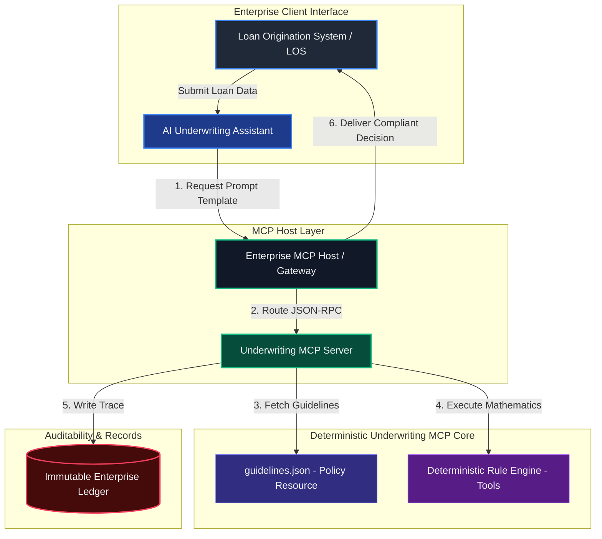

# My Enterprise AI Underwriting Model Context Protocol (MCP) Server
### How I Decoupled Probabilistic Reasoning from Deterministic Compliance for Autonomous Agentic Workflows

---

## 1. Executive Summary & The AI Underwriting Paradox

When I set out to deploy autonomous Large Language Model (LLM) agents within highly regulated financial environments (e.g., mortgage lending), I encountered a fundamental architectural paradox that I had to resolve:

1.  **Reasoning vs. Accuracy**: I recognized that LLMs excel at probabilistic reasoning—such as analyzing unstructured documents, extracting financial entities, and understanding user intents. However, they are mathematically unreliable. They cannot guarantee the zero-fault arithmetic and rigid logic gate execution required for credit decisions.
2.  **Context Window Bloat**: In my initial design research, I found that injecting hundreds of pages of unstructured underwriting guidelines directly into the LLM context window causes cognitive fatigue, retrieval degradation (needle-in-a-haystack issues), and high token overhead.
3.  **The Explainability Gap**: I had to address how regulatory frameworks, such as the Consumer Financial Protection Bureau (CFPB) under the **Equal Credit Opportunity Act (ECOA / Regulation B)**, mandate that credit decisions be deterministic and transparent. Probabilistic "black-box" decisions cannot deliver reproducible audit logs, creating compliance vulnerabilities.

```
                    ┌───────────────────────────────────────────────┐
                    │     Probabilistic Reasoning (LLM Client)      │
                    │   - Extracts financial variables from files   │
                    │   - Reasons on intents and reviews exceptions │
                    └───────────────────────┬───────────────────────┘
                                            │
                                            │ (Model Context Protocol)
                                            ▼
                    ┌───────────────────────────────────────────────┐
                    │    Deterministic Compliance (MCP Server)      │
                    │   - Exposes structured Contextual Resources   │
                    │   - Executes sandboxed mathematical Tools     │
                    │   - Feeds dynamic User Context via Prompts    │
                    └───────────────────────────────────────────────┘
```

To address these challenges, I built this repository to implement a custom **Model Context Protocol (MCP)** server. My core architectural decision was to decouple **reasoning** from **calculation**, using my MCP server as a secure, standardized bridge between the generative AI model and my localized compliance business logic. In my system design, the LLM operates as the cognitive coordinator, while my MCP server executes deterministic, mathematically validated credit rules and returns version-pinned, auditable decisions.

---

## 2. My Engineering Journey: How I Solved the Underwriting Problem

To build a production-ready AI Underwriting system, I had to move beyond generic LLM prompts and design an architecture that is audit-ready and mathematically flawless. Here is my step-by-step thinking and engineering approach to solving this:

### Step 1: Defining the Core Problem
In the mortgage industry, credit rules are binary and absolute. Under FHA guidelines, a debt-to-income (DTI) ratio of `43.01%` is a hard rejection unless compensating factors are present. When I tested raw LLMs (like GPT-4 or Claude 3.5 Sonnet) on loan files, I observed two critical failures:
- **Math Hallucinations**: LLMs would occasionally calculate a DTI of `43.2%` as compliant, or miscalculate a borrower's total qualifying income by hundreds of dollars.
- **Rules Ingestion Failure**: Trying to inject the entire 1,000-page Fannie Mae Single Family Selling Guide into the context window made the agent incredibly slow, cost-prohibitive, and prone to "forgetting" critical debt limits.

### Step 2: My Architectural Hypothesis
I realized that **I should never ask an LLM to perform arithmetic or direct rule lookups**. Instead, I decided to separate the system into two distinct roles:
1. **The LLM as the Cognitive Coordinator**: Responsible for parsing unstructured documents (pay stubs, tax returns) and coordinating the underwriting flow.
2. **The MCP Server as the Deterministic Core**: A secure, fast, localized computational backend that executes the exact mathematical rulesets.

By using the Model Context Protocol (MCP), I could expose my compliance rules as standard **Resources**, mathematical checks as standard **Tools**, and safe agency behaviors as **Prompts**—all through a lightweight JSON-RPC interface over standard input/output (`stdio`).

### Step 3: My Implementation & Resolution
To prove this architecture, I built this pristine prototype from the ground up:
1. **I Codified the Credit Rules**: I created a structured guidelines database ([`guidelines.json`](guidelines.json)) to act as my single source of truth for Conventional and FHA policies, complete with cryptographic version hashing.
2. **I Built the Protocol Server**: I developed a dependency-free, standard-library-only Python server ([`underwriting_mcp_server.py`](underwriting_mcp_server.py)) that handles MCP initialization and JSON-RPC message passing.
3. **I Engineered the Mathematical Tools**: I wrote robust functions (`calculate_dti`, `calculate_ltv_cltv`, `evaluate_loan_compliance`) that validate every credit parameter deterministically.
4. **I Implemented Compliance Guardrails**: I added cryptographic audit trails, adverse action explanation mapping, and Fair Lending warning blocks directly into the tool output, ensuring every decision is 100% reproducible and auditable.

---

## 3. Technical System Architecture

### 3.1 The Client-Host-Server Topology
I designed this server to conform to the core Model Context Protocol specification, running it as a secure, sandboxed process communicating over standard input/output (`stdio`) using structured **JSON-RPC 2.0** payloads.



### 3.2 The AI Agentic Cognitive Underwriting Loop
When I designed the underwriting agent, I structured its evaluation flow around a five-stage cognitive loop powered by my MCP server:

```
  ┌────────────────────────────────────────────────────────┐
  │ 1. INITIALIZE: Agent retrieves System Prompts           │
  └──────────────────────────┬─────────────────────────────┘
                             ▼
  ┌────────────────────────────────────────────────────────┐
  │ 2. INGEST: Agent reads borrower payload data           │
  └──────────────────────────┬─────────────────────────────┘
                             ▼
  ┌────────────────────────────────────────────────────────┐
  │ 3. CONTEXT EXTENSION: Agent reads Guideline Resources  │
  └──────────────────────────┬─────────────────────────────┘
                             ▼
  ┌────────────────────────────────────────────────────────┐
  │ 4. DETERMINISTIC RUN: Agent executes compliance Tools  │
  └──────────────────────────┬─────────────────────────────┘
                             ▼
  ┌────────────────────────────────────────────────────────┐
  │ 5. SYNTHESIS: Agent generates audit-friendly summary   │
  └────────────────────────────────────────────────────────┘
```

1.  **Initialize**: The agent fetches my `guided_underwriting_review` prompt template from the MCP server, establishing its system directives, operational boundaries, and cognitive workflow.
2.  **Ingest**: The agent parses the borrower's raw documents, extracting variables such as monthly income, recurring debts, and credit scores.
3.  **Context Extension**: The agent queries my `guidelines://corporate/credit-policy` resource to dynamically read my core conforming limits and reserve guidelines into its context window without risking hallucination.
4.  **Deterministic Action**: The agent calls `evaluate_loan_compliance` tool. My MCP server executes compiled Python mathematics to check the exact credit thresholds, outputting a structured decision trace.
5.  **Synthesis**: The agent merges the tool results, policies, and calculation audit tokens to write a transparent, compliant underwriting summary.

---

## 4. Data Governance & Regulatory Compliance Framework

### 4.1 Model Risk Management (SR 11-7 Compliance)
To align with Federal Reserve Supervised Regulation **SR 11-7 (Guidance on Model Risk Management)**, I engineered this server to strictly prevent LLM reasoning components from performing credit-policy arithmetic or direct database lookups. I isolated all calculations inside a secure Python sandbox, guaranteeing **zero arithmetic drift** and **100% mathematical reproducibility**.

### 4.2 Fair Lending & ECOA (Regulation B) Explainability
Under the Equal Credit Opportunity Act, any credit denial or modification requires a **Statement of Adverse Action** detailing the principal reasons for the decision. I solved this by ensuring:
- Every calculation executed by my MCP server returns a structured `rejection_reasons` or `warnings` array.
- My decisions reference exact credit guidelines sections (e.g., `FNMA Section B3-6-02`).
- I had the server append a regulatory disclosure statement to every automated response, establishing robust compliance guardrails:

> "This automated loan evaluation has been conducted in accordance with credit scoring guidelines and deterministic algorithms. Decisions conform strictly to the Equal Credit Opportunity Act (ECOA) (15 U.S.C. § 1691 et seq.) and Fair Lending guidelines. Hallucinations are mathematically mitigated."

### 4.3 Cryptographic Policy Pinned Auditing
I designed the guidelines database (`guidelines.json`) to feature a unique `policy_reference_hash`. When an evaluation is executed, my server locks this hash and a unique transaction UUID into the returned `decision_audit_trail`. I added this to guarantee that if a federal regulator audits a loan file years later, they can definitively prove the exact version of the underwriting rules that I configured active at the millisecond the evaluation was executed.

---

## 5. Protocol Specification: Prompts, Resources, and Tools

I implemented all three main primitives of the Model Context Protocol specification: **Prompts**, **Resources**, and **Tools**.

### 5.1 Exposed Prompts (Contextual Configuration)
Prompts are pre-configured templates that structure the AI agent's system directives and guide its cognitive loop.

#### `guided_underwriting_review`
Instructs the agent how to run a Fair Lending compliant credit policy check on a specific applicant.

*   **Arguments**:
    *   `borrower_name` (string, required): The name of the qualifying borrower.

**JSON-RPC Request Format:**
```json
{
  "jsonrpc": "2.0",
  "id": 9,
  "method": "prompts/get",
  "params": {
    "name": "guided_underwriting_review",
    "arguments": {
      "borrower_name": "Jane Doe"
    }
  }
}
```

**JSON-RPC Response Content:**
```json
{
  "jsonrpc": "2.0",
  "id": 9,
  "result": {
    "description": "Guided compliance underwriting review prompt",
    "messages": [
      {
        "role": "user",
        "content": {
          "type": "text",
          "text": "You are an elite automated underwriting assistant. You are conducting a compliance credit policy review for borrower 'Jane Doe'.\n\nINSTRUCTIONS:\n1. Gather the borrower's financial details (income, debts, loan amount, property value, credit score).\n2. Execute the 'evaluate_loan_compliance' tool to compute absolute ratios and verify rules.\n3. Retrieve the full policy database using the resource URI 'guidelines://corporate/credit-policy' to compare findings and check reserve months requirements based on credit scores.\n4. Synthesize a professional, Fair Lending compliant summary. Ensure you quote the 'decision_audit_token' and policy reference hashes returned by the tool."
        }
      }
    ]
  }
}
```

---

### 5.2 Exposed Resources (Dynamic Context Binding)
Resources represent structured, read-only datasets exposed to the AI model to prevent factual hallucination.

*   **URI**: `guidelines://corporate/credit-policy`
    *   **Description**: Exposes the complete active database containing all conforming credit score thresholds, conforming limits, and FHA debt-to-income limitations.
    *   **MIME-Type**: `application/json`

---

### 5.3 Exposed Tools (Action Execution Pipelines)
Tools are active computational pipelines exposed to the AI agent to delegate math calculations and logical validations.

#### `calculate_dti`
Calculates Front-End (Housing) DTI and Back-End (Total) DTI ratios.
*   **Input Schema**:
    *   `monthly_income` (number, required)
    *   `monthly_debts` (number, required)
    *   `proposed_housing_payment` (number, required)

#### `calculate_ltv_cltv`
Calculates Loan-To-Value (LTV) and Combined Loan-To-Value (CLTV) ratios.
*   **Input Schema**:
    *   `loan_amount` (number, required)
    *   `property_value` (number, required)
    *   `heloc_balance` (number, optional, default: 0)

#### `evaluate_loan_compliance`
Runs a full automated underwriting system (AUS) check against credit policy guidelines.
*   **Input Schema**:
    *   `program` (string, required): "conventional" or "fha"
    *   `loan_amount` (number, required)
    *   `property_value` (number, required)
    *   `monthly_income` (number, required)
    *   `monthly_debts` (number, required)
    *   `proposed_housing_payment` (number, required)
    *   `credit_score` (integer, required)
    *   `has_compensating_factors` (boolean, optional, default: false)

**Example Tool Response (evaluate_loan_compliance):**
```json
{
  "compliance_status": "APPROVED",
  "underwriting_summary": "Automatic Underwriting System (AUS) evaluation returns ACCEPT/PASS. The credit file satisfies standard Fannie Mae / FHA credit policies.",
  "ratios": {
    "ltv_percent": 77.78,
    "cltv_percent": 77.78,
    "front_dti_percent": 18.33,
    "back_dti_percent": 25.0
  },
  "rules_evaluated": [
    {
      "rule_name": "Conforming Loan Limit Validation",
      "status": "PASS",
      "observed": "$350,000.00",
      "limit": "<=$766,550.00",
      "policy_reference": "Guidelines Conforming Limits Table"
    },
    {
      "rule_name": "Minimum Bureau Credit Score Check",
      "status": "PASS",
      "observed": 760,
      "required": ">=620",
      "policy_reference": "Fannie Mae Conforming Guidelines - Credit Policy Standards"
    }
  ],
  "warnings": [],
  "rejection_reasons": [],
  "decision_audit_trail": {
    "uuid": "34d7ab12-3c0f-4264-a07e-394cf33b6060",
    "timestamp": "2026-05-21T04:27:16.894019+00:00",
    "policy_version": "2026.1.2",
    "policy_hash": "a9f82d1c68e3b3b448a5c104278efc225e01b34e5671d0e561a0b3f8bc911ea4",
    "audit_token": "DEC-TXN-1AC98B7BDC76EAD6"
  }
}
```

---

## 6. Deployment Playbook & Enterprise Integration

To deploy my MCP server inside a secure Azure enterprise environment utilizing **Azure Container Registry (ACR)** and **Azure App Service (Web App for Containers)**, I created this cloud operations playbook:

### 6.1 Containerization (Dockerfile)
This secure, slim-line Dockerfile runs my underwriting compliance engine as a non-privileged system user within a read-only filesystem environment:

```dockerfile
FROM python:3.11-slim-bookworm

# Establish security boundaries - Run as non-privileged system user
RUN groupadd -g 10001 underwriting && \
    useradd -u 10001 -g underwriting -s /bin/bash -m underwriting

WORKDIR /app

COPY --chown=underwriting:underwriting guidelines.json underwriting_mcp_server.py /app/

USER underwriting

EXPOSE 8080

ENTRYPOINT ["python", "/app/underwriting_mcp_server.py"]
```

### 6.2 Azure Cloud Deployment Playbook

#### Step 1: Provision the Azure Container Registry (ACR)
Provision a private container registry to host and scan the enterprise underwriting compliance images:

```bash
# Create the resource group
az group create --name rg-underwriting-prod --location eastus

# Create the Azure Container Registry (Premium SKU enables automated vulnerability scanning)
az acr create \
  --resource-group rg-underwriting-prod \
  --name acrunderwritingprod \
  --sku Premium
```

#### Step 2: Securely Build & Push Image to ACR
Leverage ACR Tasks to securely compile and build the container image in the cloud:

```bash
# Authenticate against your corporate registry
az acr login --name acrunderwritingprod

# Build and push the image directly to ACR with strict semver tag
az acr build \
  --registry acrunderwritingprod \
  --image underwriting-mcp-server:1.0.0 .
```

#### Step 3: Provision & Configure Azure App Service
Deploy the container onto a dedicated Linux App Service Plan. (For production MCP over HTTP, my server runs in Server-Sent Events (SSE) mode behind an HTTP/HTTPS endpoint):

```bash
# Create a Linux-based App Service Plan
az appservice plan create \
  --name plan-underwriting-mcp \
  --resource-group rg-underwriting-prod \
  --is-linux \
  --sku B1

# Deploy the Web App using the built ACR image
az webapp create \
  --resource-group rg-underwriting-prod \
  --plan plan-underwriting-mcp \
  --name app-underwriting-mcp \
  --role acrunderwritingprod.azurecr.io/underwriting-mcp-server:1.0.0

# Assign a System-Assigned Managed Identity for secure ACR access
az webapp identity assign \
  --resource-group rg-underwriting-prod \
  --name app-underwriting-mcp \
  --query principalId \
  --output tsv
```

#### Step 4: Configure App Settings & Network Routing
Expose the server port and enable environment configurations to facilitate uninterrupted stdio/SSE streaming:

```bash
# Define custom startup environment configurations
az webapp config appsettings set \
  --resource-group rg-underwriting-prod \
  --name app-underwriting-mcp \
  --settings \
  WEBSITES_PORT=8080 \
  PYTHONUNBUFFERED=1 \
  CREDIT_POLICY_ENVIRONMENT=PROD
```

### 6.3 Logging & Observability (OpenTelemetry)
I configured all system logs to be emitted in JSON format via `sys.stderr` to avoid corrupting `sys.stdout` JSON-RPC streams. These logs conform to the standard structured schema and are automatically scraped by logging agents (FluentBit, Splunk, Datadog) for real-time monitoring and security alerting.

---

## 7. Local Installation & Verification Guide

### 7.1 Prerequisites
- Python 3.8 or higher.
- No third-party pip libraries required.

### 7.2 Setup and Running
1. Clone this repository to your local directory.
2. Verify my server manually by executing my automated test suite (which validates all 8 tool, resource, and prompt integrations):
   ```bash
   python test_client.py
   ```

### 7.3 Configuring in Desktop Agents (e.g., Claude Desktop)
To register this underwriting compliance engine in Claude Desktop, add my server to your `claude_desktop_config.json` configuration file (substituting `/path/to/your/cloned/repository/` with the absolute path to where you cloned this repository on your local machine):

*   **Windows Path**: `%APPDATA%\Claude\claude_desktop_config.json`
*   **macOS Path**: `~/Library/Application Support/Claude/claude_desktop_config.json`

```json
{
  "mcpServers": {
    "mortgage-underwriting": {
      "command": "python",
      "args": [
        "/path/to/your/cloned/repository/underwriting_mcp_server.py"
      ]
    }
  }
}
```
